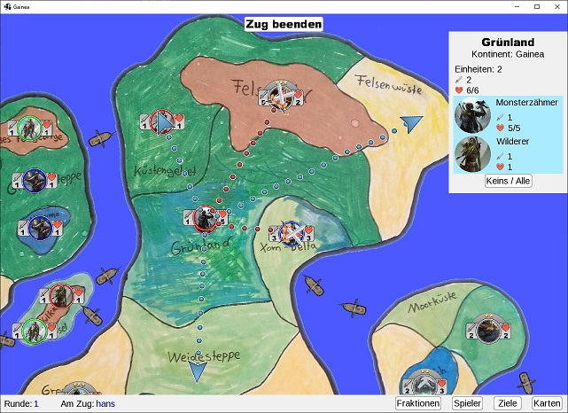

# Gainea



* Multiplayer strategy game based on the popular boardgame Risk
* World layout comes from an actual boardgame I made as a kid

## Installation

1. Checkout project
2. Install the network library: [Installation instructions](https://github.com/Rolleander/GameServerControl#installation) 

## Run Server

```
gradlew startServer
```

## Run Client

```
gradlew run
```
